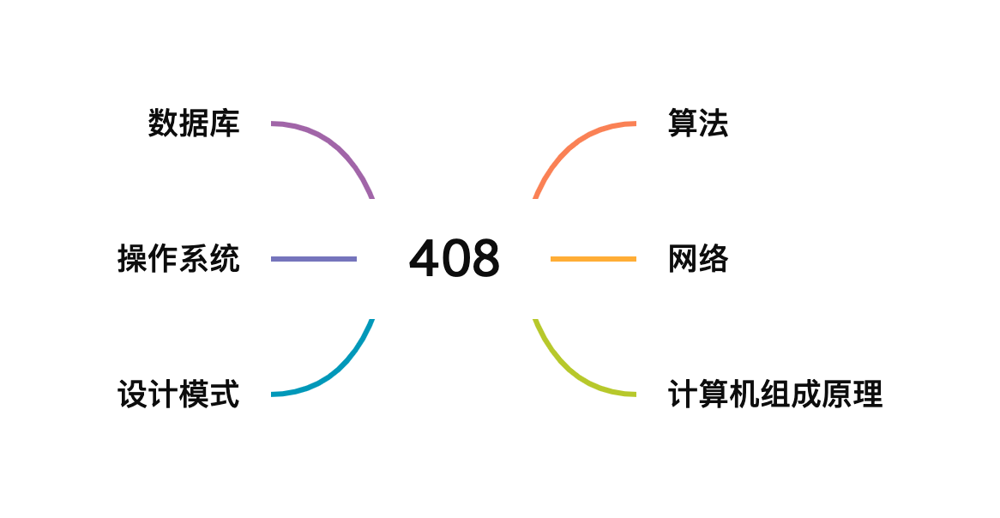

# 408

hey~，我是科科人神，目前就职于国内一家互联网公司，你们可以加我<a href="#wechat.png">微信</a>，交个朋友吧~

 

 

添加微信公众号：<a href="#wechat.png">科科人神</a>, 回复：

- `思维导图`, 获取作者总结的超详细的找工作面试秘籍，知识超级全面，并且以思维导图的方式更容易多维立体记忆。
- `面试题`, 获取经典go面试大全。

- `好友`, 可以添加作者的微信好友

## 系列教程

- [GOFamily](https://shgopher.github.io/GOFamily/) 一本为go后端程序员打造的教程
- [408](https://shgopher.github.io/408/) 一本主要以408知识为主的基础课程
- [luban](https://shgopher.github.io/luban/) 一本用鲁班的名字命名，主要讲解系统设计的书籍
- [dingdang](https://shgopher.github.io/dingdang/) 叮当，是一本讲解各种工具的书
- [god](https://shgopher.github.io/god/) 给程序员写的教程，主要关于学习，副业，买房，面试等内容，程序员才是真神！

## 算法
### 数据结构
- [数组](/数据结构/数组/README.md)
- [链表](/算法/数据结构/链表/README.md)
- [队列/栈](/算法/数据结构/队列栈/README.md)
- [堆](/算法/数据结构/堆/README.md)
- [哈希表](/算法/数据结构/哈希表/README.md)
- [二叉树](/算法/数据结构/二叉树/README.md)
- [并查集](/算法/数据结构/并查集/README.md)
- [字典树](/算法/数据结构/字典树/README.md)
- [ac自动机](/算法/数据结构/ac自动机/README.md)
- [线段树](/算法/数据结构/线段树/README.md)
- [b树](/算法/数据结构/b树/README.md)
- [布隆过滤器](/算法/数据结构/布隆过滤器/README.md)
- [布谷鸟过滤器](/算法/数据结构/布谷鸟过滤器/README.md)
- [lru cache](/算法/数据结构/lrucache/README.md)
- [图](/算法/数据结构/图/README.md)
- [位图](/算法/数据结构/位图/README.md)
- [跳表](/算法/数据结构/跳表/README.md)
- [舞蹈链](/算法/数据结构/舞蹈链/README.md)
- [森林](/算法/数据结构/森林/README.md)
### 算法
- [dp](/算法/算法/dp/README.md)
- [贪心](/算法/算法/贪心/README.md)
- [分治](/算法/算法/分治/README.md)
- [回溯](/算法/算法/回溯/README.md)
- [dfs](/算法/算法/dfs/README.md)
- [bfs](/算法/算法/bfs/README.md)
- [排序算法](/算法/算法/排序算法/README.md)
- [二分法](/算法/算法/二分法/README.md)
- [拓跋排序](/算法/算法/拓跋排序/README.md)
- [最短路径](/算法/算法/最短路径/README.md)
- [短地址生成算法](/算法/算法/短地址生成算法/README.md)
- [字符串匹配算法](/算法/算法/字符串匹配算法/README.md)
- [限流算法](/算法/算法/限流算法/README.md)
- [唯一id生成算法](/算法/算法/唯一id生成算法/README.md)
- [抢红包算法](/算法/算法/抢红包算法/README.md)
- [topk](/算法/算法/topk/README.md)
- [洗牌算法](/算法/算法/洗牌算法/README.md)
- [限流算法](/算法/算法/限流算法/README.md)
### 算法题
- [排序类](/算法/算法题/排序类/README.md)
- [链表类](/算法/算法题/链表类/README.md)
- [堆，栈，队列，哈希表](/算法/算法题/堆栈队列哈希表/README.md)
- [二分法](/算法/算法题/二分法/README.md)
- [双指针](/算法/算法题/双指针/README.md)
- [BFS](/算法/算法题/BFS/README.md)
- [DFS](/算法/算法题/DFS/README.md)
- [前缀和](/算法/算法题/前缀和/README.md)
- [并查集](/算法/算法题/并查集/README.md)
- [字典树](/算法/算法题/字典树/README.md)
- [单调栈/队列](/算法/算法题/单调栈队列/README.md)
- [扫描线算法](/算法/算法题/扫描线算法/README.md)
- [TreeMap](/算法/算法题/TreeMap/README.md)
- [动态规划](/算法/算法题/动态规划/README.md)
## 网络
- ip
- tcp
- udp
- http
- 负载均衡
- dns
- 客户端缓存
- 传输链路
- cdn
### 数据库
### 理论基础
### sql
- sql
- mysql
### nosql
- redis
- 服务器缓存
- mongodb
### newsql
- tidb
## 操作系统
- 文件系统
- 输入和输出
- Linux 网络系统
- ebpf
## 组成原理
### 设计模式   
- 创建型
- 结构型
- 行为型
### 其它设计模式
- 函数式编程
- 声明式编程
- 命令式编程                   

## 扫一扫添加我的公众号，回复 “加群”，可以加入微信群。

 
 

                                                                             
## star

                      