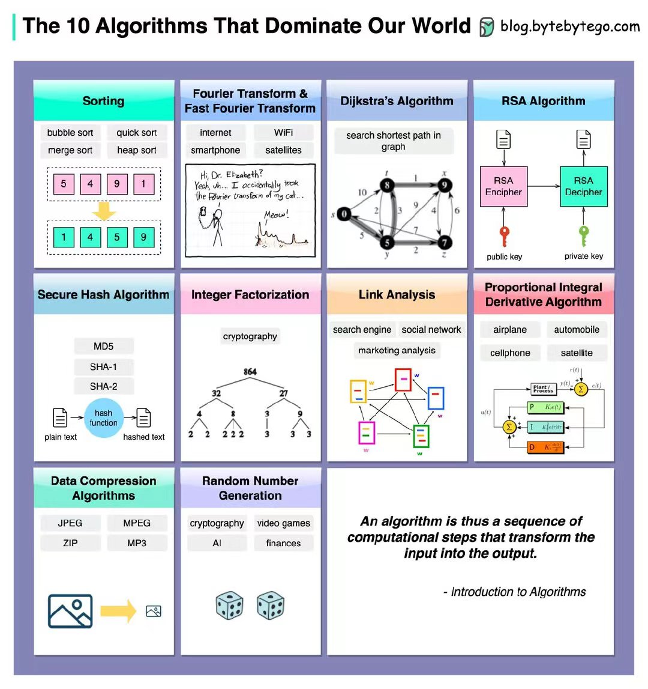

<!--
 * @Author: shgopher shgopher@gmail.com
 * @Date: 2023-05-18 14:42:07
 * @LastEditors: shgopher shgopher@gmail.com
 * @LastEditTime: 2023-05-18 15:28:32
 * @FilePath: /408/算法/概述/十大著名算法概要/README.md
 * @Description: 
 * 
 * Copyright (c) 2023 by shgopher, All Rights Reserved. 
-->
# 十大著名算法概要

## 排序算法
`从是否比较来分`

- 比较排序算法：
比较排序算法是最常用的排序算法，它们通过比较数组中的元素进行排序。常见的比较排序算法包括冒泡排序、插入排序、选择排序、归并排序和快速排序等。

- 非比较排序算法：
非比较排序算法不需要比较数组中的元素，而是根据元素的其他属性进行排序。常见的非比较排序算法包括计数排序、基数排序和桶排序等。

`从是否稳定来分`

- 稳定排序算法：
稳定排序算法会保持数组中相等元素的相对顺序不变。常见的稳定排序算法包括插入排序、归并排序和冒泡排序等。

不稳定排序算法：
不稳定排序算法会改变数组中相等元素的相对顺序。常见的不稳定排序算法包括快速排序、选择排序和堆排序等。

`其它分类方法`

- 原地排序算法：
原地排序算法只使用常数级别的额外空间，而不需要额外的辅助数组。常见的原地排序算法包括快速排序、堆排序和插入排序等。

- 外部排序算法：
外部排序算法用于处理大量数据，它们将数据分成多个小块，并使用排序算法对每个小块进行排序，然后将它们合并成一个有序的数据集。常见的外部排序算法包括归并排序和快速排序等。

## 傅里叶变换和快速傅里叶变换
傅里叶变换和快速傅里叶变换是数字信号处理中广泛使用的重要工具。以下是傅里叶变换和快速傅里叶变换的一些常见类型：

- 离散傅里叶变换 (DFT)：
离散傅里叶变换是傅里叶变换在离散时间下的表示，它将离散时间序列转换为离散频率域上的频谱。离散傅里叶变换可以用于信号处理、图像处理和通信等领域。

- 快速傅里叶变换 (FFT)：
快速傅里叶变换是计算离散傅里叶变换的一种快速算法，它可以大幅提高计算速度和效率。快速傅里叶变换广泛应用于数字信号处理、图像处理、声音处理和通信等领域。

- 连续傅里叶变换 (CTFT)：
连续傅里叶变换是傅里叶变换在连续时间下的表示，它将连续时间信号转换为连续频率域上的频谱。连续傅里叶变换可以用于信号处理、图像处理和通信等领域。

- 离散余弦变换 (DCT)：
离散余弦变换是一种将时域离散信号转换为频域离散信号的变换方法，它将信号表示为一组余弦函数的加权和。离散余弦变换广泛应用于数字信号处理、图像处理和视频压缩等领域。

- 离散小波变换 (DWT)：
离散小波变换是一种将时域离散信号转换为时域离散小波系数的变换方法，它将信号分解为不同频率的小波子带。离散小波变
## dijkstra 最短路径
Dijkstra 最短路径算法是一种用于寻找图中两个顶点之间最短路径的算法。以下是 Dijkstra 最短路径算法的一些常见类型：

- 单源最短路径算法：
单源最短路径算法是指从一个固定顶点出发，计算出该顶点到图中其他所有顶点的最短路径。Dijkstra 算法就是一种单源最短路径算法。

- 分布式最短路径算法：
分布式最短路径算法是指将计算任务分配给多个节点进行计算，以提高计算效率和性能。分布式最短路径算法可以应用于分布式计算、云计算和大数据处理等领域。

- 全源最短路径算法：
全源最短路径算法是指计算出图中任意两个顶点之间的最短路径。Floyd-Warshall 算法就是一种全源最短路径算法。

- 负权边最短路径算法：
负权边最短路径算法是指可以处理图中存在负权边的最短路径问题。常见的负权边最短路径算法包括 Bellman-Ford 算法和 SPFA 算法等。

- 多源最短路径算法：
多源最短路径算法是指计算出图中多个顶点之间的最短路径。常见的多源最短路径算法包括 Johnson 算法和多源 Dijkstra 算法等。
## rsa 非对称加密
RSA 非对称加密算法是一种流行的加密算法，它可以实现数据的加密和解密，以保护数据的机密性和完整性。以下是 RSA 非对称加密算法的一些常见类型：

RSA 密钥生成算法：
RSA 密钥生成算法是指生成公钥和私钥的算法，公钥可以公开，私钥需要保密。RSA 密钥生成算法通常使用大素数和欧拉函数进行计算，以保证加密强度和安全性。

RSA 加密算法：
RSA 加密算法是指使用公钥对数据进行加密的算法，加密后的数据只能使用私钥进行解密。RSA 加密算法可以用于网络通信、数据传输和电子商务等领域。

RSA 解密算法：
RSA 解密算法是指使用私钥对加密后的数据进行解密的算法。RSA 解密算法可以用于数据解密、身份验证和数字签名验证等领域。

RSA 签名算法：
RSA 签名算法是指使用私钥对数据进行签名的算法，签名后的数据可以用于数字身份验证和数据完整性验证。RSA 签名算法可以用于电子文档签名、数字证书和电子合同等领域。

RSA 密钥交换算法：
RSA 密钥交换算法是指使用公钥加密和私钥解密的过程来交换密钥的算法，以保证通信安全性和机密性。RSA 密钥交换算法可以用于网络通信、数据传输和电子商务等领域。
## 安全哈希算法，sha 系列算法
SHA (Secure Hash Algorithm) 系列算法是一组广泛使用的密码学哈希函数，用于计算数字摘要和消息认证代码等。以下是 SHA 系列算法的全部类型：

- SHA-0：
SHA-0 是最早的 SHA 算法，于1993年发布，但由于存在安全漏洞，很快就被 SHA-1 取代。

- SHA-1：
SHA-1 是一种安全的哈希算法，于1995年发布，被广泛应用于数字证书、SSL 和 TLS 等安全协议中。但是，由于 SHA-1 存在安全漏洞，已经被逐渐淘汰。

- SHA-2：
SHA-2 是一组安全的哈希算法，包括 SHA-224、SHA-256、SHA-384 和 SHA-512 等四种类型，它们具有更高的安全性和更长的哈希值，可以有效地保护数据的完整性和机密性。

- SHA-3：
SHA-3 是一种新的哈希算法，于2015年发布，它是 Keccak 算法的变种，具有更高的安全性和更好的性能。SHA-3 算法适用于数字签名、消息认证和随机数生成等领域。

以上是 SHA 系列算法的全部类型，根据不同的安全要求和应用场景，我们可以选择合适的算法进行使用。需要注意的是，为了保证数据的安全性，我们应该使用最新的和最安全的哈希算法。
## 整数分解算法
整数分解算法是指将一个大整数分解为多个质因数的算法，它在密码学、计算机安全和数学等领域中有着广泛的应用。以下是整数分解算法的一些类型：

- 暴力枚举法：
暴力枚举法是最简单的整数分解算法，它通过枚举所有可能的因数来分解整数。但由于枚举的时间复杂度非常高，所以在实际应用中几乎不会使用。

- 质因数分解法：
质因数分解法是一种较为高效的整数分解算法，它通过反复分解为质数的方法来分解整数。质因数分解法的计算复杂度相对较低，但对于非常大的整数，它仍然需要很长的时间来计算。

- Pollard rho 算法：
Pollard rho 算法是一种基于随机算法的整数分解算法，它通过随机生成数列来分解整数。Pollard rho 算法的计算复杂度相对较低，但对于某些整数，它的计算效率可能会较低。

- 矩阵分解法：
矩阵分解法是一种基于线性代数的整数分解算法，它通过将矩阵分解为质因数的乘积来分解整数。矩阵分解法的计算复杂度相对较低，但需要较高的数学基础和专业知识。

- 数域筛法：
数域筛法是一种基于数论的整数分解算法，它通过在有限域中进行筛选来分解整数。
## 链接分析 (例如 PageRank)
链接分析 (Link Analysis) 是指对网络中的链接关系进行分析的一种方法，它可以用来评估网页的重要性、发现网络中的社区结构和识别垃圾邮件等。以下是链接分析的一些类型：

- PageRank 算法：
PageRank 算法是一种著名的链接分析算法，它通过计算网页的入链和出链来评估网页的重要性。PageRank 算法是 Google 搜索引擎的核心算法之一，它可以用来提高搜索结果的相关性和质量。

- HITS 算法：
HITS 算法是一种链接分析算法，它通过计算网页的权威性和枢纽性来评估网页的重要性。HITS 算法可以用来识别网络中的社区结构和关键节点。

- SALSA 算法：
SALSA 算法是一种基于对称链接的链接分析算法，它通过计算网页的同步权威性和同步枢纽性来评估网页的重要性。SALSA 算法可以用来识别对称网络中的关键节点和社区结构。

- TrustRank 算法：
TrustRank 算法是一种基于信任网络的链接分析算法，它通过计算网页的信任值和不信任值来评估网页的重要性。TrustRank 算法可以用来识别垃圾邮件和欺诈行为等。

- SimRank 算法：
SimRank 算法是一种相似性链接分析算法，它通过计算网页之间的相似度来评估网页的重要性。SimRank 算法可以用来发现网络中的相似节点和子图。

## PID 控制算法，用在各类型电机控制
PID 控制算法是一种经典的控制算法，它可以通过反馈控制来调节系统的输出。以下是 PID 控制算法的一些类型：

- 标准 PID 控制算法：
标准 PID 控制算法是最常见的 PID 控制算法，它由比例控制部分、积分控制部分和微分控制部分组成，可以用于控制温度、速度、位置和压力等。

- 串级 PID 控制算法：
串级 PID 控制算法是一种 PID 控制的改进算法，它通过级联两个 PID 控制器来实现更加精确的控制。串级 PID 控制算法可以用于控制高精度和高灵敏度的工业过程。

- 自适应 PID 控制算法：
自适应 PID 控制算法是一种自适应 PID 控制算法，它可以根据系统的实际情况自动调整 PID 参数，以实现更加精确的控制。自适应 PID 控制算法可以用于控制复杂的非线性系统。

- 增量 PID 控制算法：
增量 PID 控制算法是一种改进的 PID 控制算法，它通过计算输出变化量和误差变化量来调整 PID 参数，可以提高控制的响应速度和稳定性。增量 PID 控制算法可以用于控制快速变化的系统。

- 分段 PID 控制算法：
分段 PID 控制算法是一种 PID 控制的改进算法，它将控制范围分为多个段落，并针对每个段落采用不同的 PID 参数。分段 PID 控制算法可以用于控制非线
## 数据压缩算法
数据压缩算法是一种将数据进行压缩以减少存储空间和传输带宽的算法。以下是数据压缩算法的一些类型：

无损压缩算法：
无损压缩算法是一种可以在不损失数据的情况下对数据进行压缩的算法，常见的无损压缩算法有：LZ77、LZW、Huffman 编码、算术编码和 Burrows-Wheeler 变换等。

有损压缩算法：
有损压缩算法是一种可以在一定程度上损失数据的情况下对数据进行压缩的算法，常见的有损压缩算法有：JPEG、MPEG、MP3、AAC、FLAC 和 WAVPACK 等。

预处理压缩算法：
预处理压缩算法是一种在压缩之前对数据进行预处理的算法，以提高压缩效率。常见的预处理压缩算法有：BWT、Move-to-Front、Run-length Encoding 和 Delta Encoding 等。

字典压缩算法：
字典压缩算法是一种通过建立字典来实现数据压缩的算法，它可以在一定程度上提高压缩效率。常见的字典压缩算法有：LZ77、LZW、LZSS 和 DEFLATE 等。

自适应压缩算法：
自适应压缩算法是一种根据数据的特性动态调整压缩算法的算法，以提高压缩效率。常见的自适应压缩算法有：PPM、PAQ、CM 和 Tangelo 等
## 随机数生成算法
随机数生成算法是一种用于生成随机数的算法，它在密码学、模拟实验和游戏等领域中有着广泛的应用。以下是随机数生成算法的一些类型：

梅森旋转算法 (Mersenne Twister)：
梅森旋转算法是一种高质量的伪随机数生成算法，它采用 32 位或 64 位的状态和 624 个参数来生成随机数。梅森旋转算法具有周期长、分布均匀、速度快和易于实现等优点，被广泛应用于游戏、模拟和密码学等领域。

线性同余生成器 (Linear Congruential Generator，LCG)：
线性同余生成器是一种简单的伪随机数生成算法，它通过一个线性递推公式来产生随机数。线性同余生成器具有速度快和易于实现等优点，但容易产生重复和周期性的随机数。

拉格朗日插值随机数生成算法 (Lagrange Interpolation Random Number Generator)：
拉格朗日插值随机数生成算法是一种基于拉格朗日插值的随机数生成算法，它通过多项式插值来生成随机数。拉格朗日插值随机数生成算法具有分布均匀和周期长等优点，被广泛应用于密码学和模拟实验等领域。

随机数池 (Random Pool)：
随机数池是一种通过收集多个随机源来生成随机数的算法，它可以提高随机性和安
