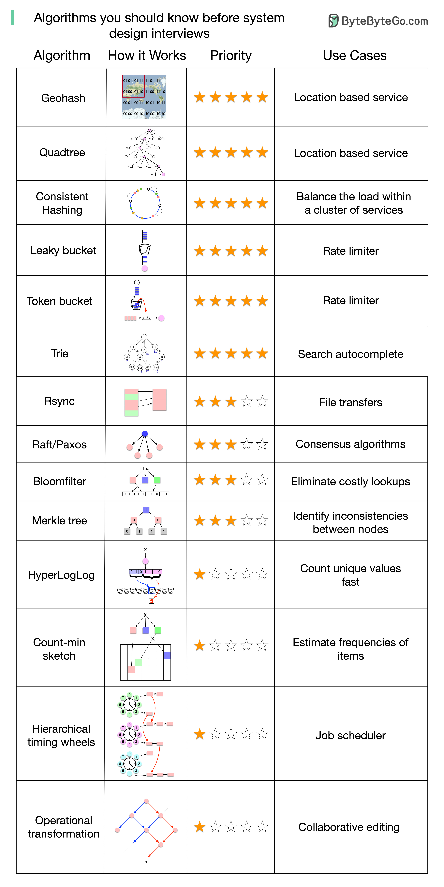

<!--
 * @Author: shgopher shgopher@gmail.com
 * @Date: 2023-05-18 15:16:43
 * @LastEditors: shgopher shgopher@gmail.com
 * @LastEditTime: 2023-05-18 16:08:35
 * @FilePath: /408/算法/概述/对系统设计非常重要的算法/README.md
 * @Description: 
 * 
 * Copyright (c) 2023 by shgopher, All Rights Reserved. 
-->
# 对系统设计非常重要的算法

## geohash
Geohash是一种将地理坐标转换为字符串编码的算法，它可以将地球表面的任意位置表示为一个短字符串，方便存储、传输和查询。Geohash算法基于网格划分的思想，将地球表面划分为多个矩形区域，并为每个区域分配一个唯一的字符串编码。以下是Geohash算法的一些特点和应用：

特点：
Geohash算法可以将地球表面的任意位置表示为一个短字符串，长度可以根据需要进行调整。
Geohash算法可以方便地进行存储、传输和查询，特别是在分布式系统和互联网应用中具有很大的优势。
Geohash算法可以进行空间检索和空间分析，可以用于地理信息系统、位置服务和社交网络等领域。
应用：
Geohash算法可以用于实现位置服务和地理信息系统，可以方便地查找某个地理位置附近的商店、餐厅、银行等。
Geohash算法可以用于实现社交网络和位置共享应用，可以方便地查找朋友的位置、分享自己的位置和查找附近的用户。
Geohash算法可以用于实现地理数据可视化和空间分析，可以方便地进行热力图、聚类分析和路径规划等。
## quadtree
四叉树（Quadtree）是一种基于分治思想的数据结构，它可以用于表示和处理二维空间中的静态或动态对象。四叉树将二维空间递归地划分为四个象限，每个象限又可以继续递归地划分为四个子象限，直到达到某个终止条件。以下是四叉树的一些特点和应用：

特点：
四叉树可以用于表示和处理二维空间中的静态或动态对象，如地图数据、图像数据和游戏对象等。
四叉树的节点可以表示一个矩形区域，可以用于空间索引和空间查询，如区域搜索和范围查询等。
四叉树可以进行动态插入、删除和查询操作，可以用于实现空间可视化和交互式应用。
应用：
四叉树可以用于实现地图数据的存储和查询，可以方便地进行区域搜索和范围查询，如查找某个城市的地理位置或者附近的商店、餐厅、银行等。
四叉树可以用于实现图像数据的存储和处理，可以方便地进行图像压缩、缩放和裁剪等操作，如将一张大图分成多个小块进行处理。
四叉树可以用于实现游戏对象的存储和查询，可以方便地进行碰撞检测、光照计算和路径规划等操作，如在一个二维平面上模拟一个游戏世界。
## 一致性哈希
一致性哈希（Consistent Hashing）是一种用于分布式系统中的负载均衡算法，它可以将数据或服务均匀地分布到多台服务器上，以实现高可用、高性能和高扩展性。一致性哈希算法基于哈希函数的思想，将整个哈希空间划分为多个虚拟节点，并将虚拟节点映射到服务器环上。当有新的数据或请求到来时，一致性哈希算法会根据哈希值找到对应的虚拟节点，并将数据或请求路由到虚拟节点所在的服务器上。以下是一致性哈希算法的一些特点和应用：

特点：
一致性哈希算法可以将数据或服务均匀地分布到多台服务器上，以实现负载均衡和故障恢复。
一致性哈希算法可以在增加或删除服务器时，最小化数据或服务的迁移量，从而保证系统的可用性和性能。
一致性哈希算法可以用于实现分布式缓存、分布式数据库和分布式消息队列等应用。
应用：
一致性哈希算法可以用于实现分布式缓存，如Memcached和Redis等，可以将缓存数据均匀地分布到多台服务器上，以提高缓存访问的性能和可用性。
一致性哈希算法可以用于实现分布式数据库，如Cassandra和HBase等，可以将数据均匀地分布到多台服务器上，以支持大规模数据存储和查询。
一致性哈希算法可以用于实现分布式消息队列，如Kafka和RabbitMQ等，可以
## 漏桶
漏桶算法（Leaky Bucket Algorithm）是一种流量控制算法，它可以平滑地限制流量的速率，并且可以在一定程度上缓解流量的突发性。漏桶算法的原理类似于一个漏桶，它可以持续地向外泄漏一定速率的水滴，当水滴过多时，就会溢出桶外。在漏桶算法中，水滴代表请求或数据包，漏桶代表处理请求或传输数据的带宽，漏桶速率代表带宽的限制。以下是漏桶算法的一些特点和应用：

特点：
漏桶算法可以平滑地限制流量的速率，可以防止网络拥塞和资源耗尽。
漏桶算法可以在一定程度上缓解流量的突发性，可以提高系统的稳定性和可靠性。
漏桶算法可以用于实现流量控制和限流器等应用。
应用：
漏桶算法可以用于实现网络带宽限制器，可以限制网络流量的速率，防止网络拥塞和资源耗尽。
漏桶算法可以用于实现请求限流器，可以限制请求的速率，防止DDoS攻击和资源耗尽。
漏桶算法可以用于实现消息队列的流控，可以限制消息的速率，防止消息积压和资源耗尽。
漏桶算法可以用于实现缓存系统的流控，可以限制缓存的速率，防止缓存雪崩和资源耗尽。
## 令牌桶
令牌桶算法（Token Bucket Algorithm）是一种流量控制算法，它可以平滑地限制流量的速率，并且可以在一定程度上缓解流量的突发性。令牌桶算法的原理类似于一个令牌桶，它可以持续地生成一定速率的令牌，当令牌数量过多时，就会丢弃多余的令牌。在令牌桶算法中，令牌代表请求或数据包，令牌桶代表处理请求或传输数据的带宽，令牌速率代表带宽的限制。以下是令牌桶算法的一些特点和应用：

特点：
令牌桶算法可以平滑地限制流量的速率，可以防止网络拥塞和资源耗尽。
令牌桶算法可以在一定程度上缓解流量的突发性，可以提高系统的稳定性和可靠性。
令牌桶算法可以用于实现流量控制和限流器等应用。
应用：
令牌桶算法可以用于实现网络带宽限制器，可以限制网络流量的速率，防止网络拥塞和资源耗尽。
令牌桶算法可以用于实现请求限流器，可以限制请求的速率，防止DDoS攻击和资源耗尽。
令牌桶算法可以用于实现消息队列的流控，可以限制消息的速率，防止消息积压和资源耗尽。
令牌桶算法可以用于实现缓存系统的流控，可以限制缓存的速率，防止缓存雪崩和资源耗尽
## 字典树
字典树（Trie Tree）是一种用于字符串处理的数据结构，它可以快速地进行字符串的插入、查找和删除操作。字典树的基本思想是将一组字符串按照前缀的顺序组织起来，形成一个树形结构。字典树的每个节点都代表一个字符串的前缀，从根节点到叶子节点的路径表示一个完整的字符串。以下是字典树的一些特点和应用：

特点：
字典树可以快速地进行字符串的插入、查找和删除操作，时间复杂度为O(k)，其中k是字符串的长度。
字典树可以用于实现字符串的匹配和前缀匹配，可以方便地查找某个字符串或者某个前缀的出现次数。
字典树可以用于实现字符串的排序和去重，可以方便地进行字符串的排序和去重操作。
应用：
字典树可以用于实现搜索引擎的索引和查询，可以方便地进行关键词的匹配和排序。
字典树可以用于实现字符串的自动补全和提示，可以根据用户输入的前缀，自动补全和提示后续的字符串。
字典树可以用于实现字符串的拼写检查和纠错，可以根据用户输入的字符串，检查和纠错其中的错误。
字典树可以用于实现字符串的统计和分析，可以方便地统计某个字符串或者某个前缀的出现次数，或者分析字符串出现的规律和趋势。
## rsync
Rsync算法是一种用于数据传输和备份的增量同步算法，它可以在两个文件之间快速地找到差异，并只传输修改的部分，从而节省带宽和时间。Rsync算法的基本思想是将原始文件和目标文件分别划分为多个块，并通过哈希函数计算每个块的指纹，然后将指纹列表进行比较，找到匹配的块，并将匹配的块进行复制或传输。以下是Rsync算法的一些特点和应用：

特点：
Rsync算法可以快速地找到两个文件之间的差异，并只传输修改的部分，从而节省带宽和时间。
Rsync算法可以在两个文件之间进行增量同步，可以实现数据的持续备份和远程同步。
Rsync算法可以通过哈希函数计算每个块的指纹，可以对数据进行完整性校验和错误检测。
应用：
Rsync算法可以用于实现数据备份和同步，如文件同步、数据库备份、镜像同步等。
Rsync算法可以用于实现版本控制和代码同步，如Git、SVN和CVS等。
Rsync算法可以用于实现P2P文件共享和云存储，如BitTorrent和Dropbox等。
Rsync算法可以用于实现大数据传输和分布式计算，如Hadoop和Spark等。
## raft算法
Raft算法是一种分布式一致性算法，它可以确保多个节点之间的数据一致性，从而保证分布式系统的正确性和可靠性。Raft算法的基本思想是将多个节点组织成一个领导者和多个跟随者的集群，领导者负责接收客户端请求，并将其复制到所有跟随者的日志中，然后通知跟随者提交日志。Raft算法通过选举机制和日志复制机制来实现领导者的选举和日志的复制。以下是Raft算法的一些特点和应用：

特点：
Raft算法的实现相对较为简单和易于理解，有利于代码的实现和维护。
Raft算法可以快速地进行领导者选举和日志复制，可以保证分布式系统的正确性和可靠性。
Raft算法可以在网络分区和节点故障等情况下，自动进行节点的容错和故障恢复。
应用：
Raft算法可以用于实现分布式数据库，如TiDB和CockroachDB等，可以保证多个节点之间的数据一致性和可靠性。
Raft算法可以用于实现分布式锁和分布式队列等应用，可以保证多个节点之间的互斥和顺序性。
Raft算法可以用于实现分布式文件系统，如HDFS和Ceph等，可以保证多个节点之间的数据一致性和可靠性。
Raft算法可以用于实现分布式计算框架，如Spark和Flink等，可以保证多个节点之间的任务调度和数据共享。
## 布隆过滤器
布隆过滤器（Bloom Filter）是一种快速判断某个元素是否属于某个集合的数据结构，它可以高效地进行元素的查询和添加操作，并且可以有效地节省存储空间。布隆过滤器的基本思想是使用多个哈希函数对元素进行哈希，并将哈希结果映射到一个位数组中，如果某个位数组中的所有位都为1，则认为该元素可能在集合中；如果某个位数组中的任意一位为0，则认为该元素一定不在集合中。以下是布隆过滤器的一些特点和应用：

特点：
布隆过滤器可以高效地进行元素的查询和添加操作，时间复杂度为O(k)，其中k是哈希函数的个数。
布隆过滤器可以有效地节省存储空间，空间复杂度为O(m)，其中m是位数组的长度。
布隆过滤器可以根据需要动态调整哈希函数的个数和位数组的长度，以满足不同的应用场景。
应用：
布隆过滤器可以用于实现缓存系统和反垃圾邮件系统等应用，可以高效地进行元素的查询和添加操作。
布隆过滤器可以用于实现网页爬虫和数据去重等应用，可以有效地节省存储空间和网络带宽。
布隆过滤器可以用于实现分布式系统和多级缓存系统等应用，可以提高系统的性能和可靠性。
布隆过滤器可以用于实现数据安全和隐私保护等应用，可以避免敏感信息的泄露和篡改。
## 默克尔树
Merkle Tree（默克尔树）是一种哈希树结构，它可以高效地验证大量的数据是否被篡改，并且能够快速定位到被篡改的数据块。Merkle Tree的基本思想是将数据分成若干个数据块，对每个数据块进行哈希，并将哈希结果组成一个哈希树。哈希树的叶子节点代表数据块的哈希值，每个非叶子节点代表叶子节点的哈希值的哈希值。通过递归地计算每个非叶子节点的哈希值，可以得到一个根哈希值，它代表了所有数据块的哈希值的哈希值。以下是Merkle Tree的一些特点和应用：

特点：
Merkle Tree可以高效地验证大量的数据是否被篡改，时间复杂度为O(log n)，其中n是数据块的数量。
Merkle Tree可以快速定位到被篡改的数据块，只需要计算一小部分节点的哈希值即可。
Merkle Tree可以支持动态数据块的添加和删除操作，只需要重新计算受影响的节点的哈希值即可。
应用：
Merkle Tree可以用于实现区块链和加密货币等应用，可以保证交易数据的完整性和可靠性。
Merkle Tree可以用于实现分布式存储和文件传输等应用，可以保证数据的一致性和可靠性。
Merkle Tree可以用于实现数据备份和恢复等应用，可以保证备份数据的完整性和可靠性。
Merkle Tree可以用于实现数据安全和隐私保护等应用，可以避免敏感信息的泄露和篡改。
